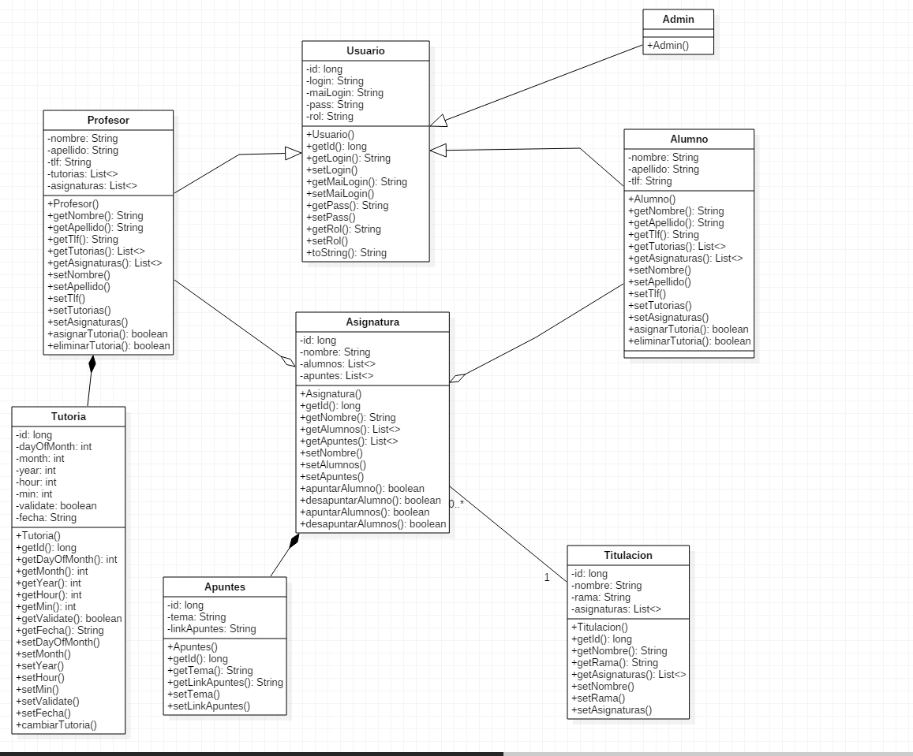
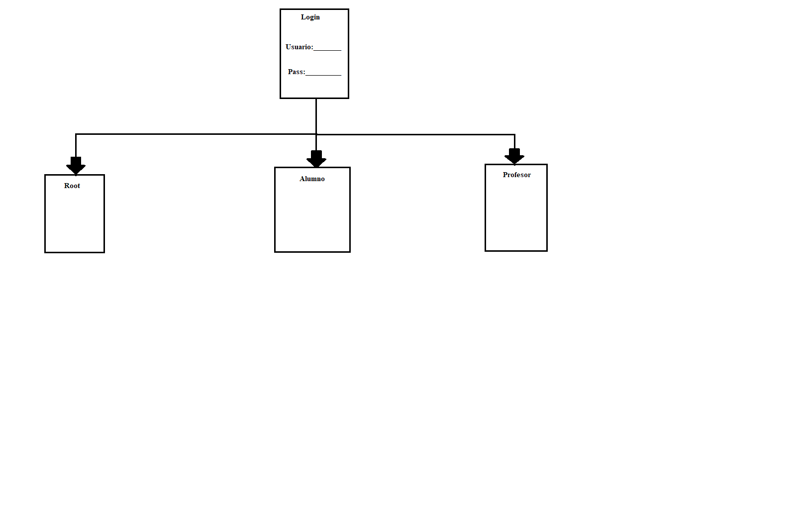
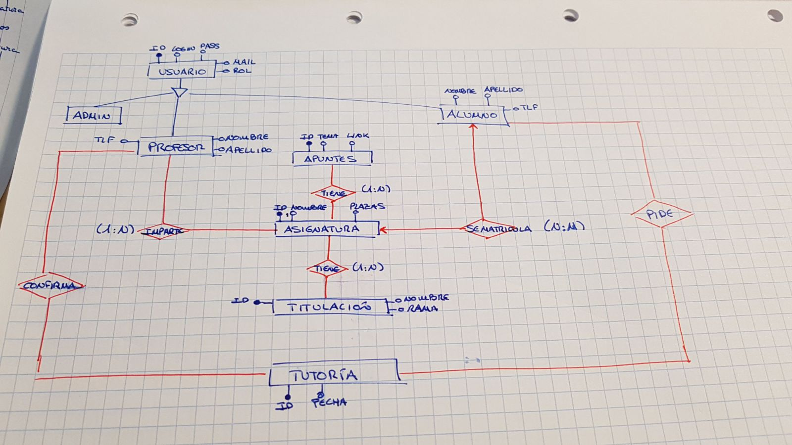

# URJC-Academy
# Descripción de la web
La aplicación pretende agilizar las labores de administración, admisión, gestión y planificación de la actividad de una academia universitaria.
-  Parte Pública: Consistirá en una capa muy sencilla en donde los usuarios no registrados puedan obtener información de los cursos o asignaturas que se realizan en la academia. Si están interesados, podrán darse de alta como usuarios "Alumno", a través de un sencillo formulario de inscripción.
-  Parte Privada: 
    -   Alumno: El alumno podrá inscribirse en una o varias asignaturas, solicitar tutorias de refuerzo a los profesores, descargar apuntes de las clases, etc.
    -   Profesor: El profesor podrá validar solicitudes para tutorías, cambiar la fecha de una clase, subir apuntes, etc.
    -   Administrador: Se encargará de gestionar la página, dando de alta o baja a usuarios. Se encargará de habilitar enlaces de recuperación de contraseña, a aquellos usuarios registrados que no recuerden su contraseña de acceso, etc.
    
# Entidades
-   Alumno: Usuario final básico. Entre sus funciones estarán la de inscribirse a una o varias asignaturas, valorar la labor de los profesores, así como solicitar tutoriás a los profesores a través de la aplicación.
-   Profesor: Usuario final con ciertos privilegios, que le permitirán cerrar la fecha de las tutorías con los alumnos, cambiar la fecha de una clase, subir apuntes a la apliacación. Cada profesor tendrá una columna con la valoración media emitida por todos los alumnos a los que haya dado clase.
-   Administrador: Usuario con privilegios de root.
-   Titulación: Repositorio en donde los alumnos podrán consultar, e inscribirse a todas las asignaturas de su titulación.
-   Asignatura/Clase: Asignatura x de una titulación y. La clase la dara un profesor para un grupo de alumnos, en una fecha establecida.
-   Tutoria:  Clase personalizada, que previamente será solicitada por un alumno, y validada por un profesor.
-   Apuntes. 
# Diagrama de Clases
Este es el diagrama de clases de nuestra aplicación, siempre sujeto a cambios si fuese necesario.

# Diagrama de transicion pantallas.
La transicion entre pantallas es sencilla ya que este es el esquema base de nuestra aplicación. A medida que añadamos funcionalidades el número de pantallas puede aumentar.

# Diagrama Entidad-Relación
A continuación se puede observar el diagrama Entidad-Relación de nuestro modelo de datos.

# Servicio Interno
-   La apliación ha de ser capaz de mantener informados a los usuarios vía correo electrónico, o vía whatsapp (si podemos conseguir implementar este último), de cualquiera de los cambios que se produzcan en la página web, referidos al planning de la propia academía.

# Servidor Caché 
-   Para implementar la Caché en primer lugar hemos añadido dependencias adicionales en el archivo pom.xml:

        <dependency>
            <groupId>com.fasterxml.jackson.core</groupId>
            <artifactId>jackson-databind</artifactId>
            <version>2.5.3</version>
        </dependency>

        <dependency>
            <groupId>com.fasterxml.jackson.datatype</groupId>
            <artifactId>jackson-datatype-jsr310</artifactId>
            <version>2.5.3</version>
        </dependency>

        <dependency>
            <groupId>org.springframework.session</groupId>
            <artifactId>spring-session</artifactId>
        </dependency>

        <dependency>
            <groupId>com.hazelcast</groupId>
            <artifactId>hazelcast</artifactId>
            <version>3.9.3</version>
        </dependency>
        <dependency>
                <groupId>com.hazelcast</groupId>
                <artifactId>hazelcast-spring</artifactId>
                <version>${hazelcast.version}</version>
        </dependency>
        <dependency>
                <groupId>com.hazelcast</groupId>
                <artifactId>hazelcast-wm</artifactId>
                <version>3.8.3</version>
        </dependency>
        
-  En nuestra aplicación hemos decidido cachear las Titulaciones, para probar que la Caché funciona correctamente. Para ello hemos tenido que modificar el código fuente de nuestra aplicación.
1-  Titualción repository:

@CacheConfig(cacheNames="titulaciones")

public interface TitulacionRepository extends JpaRepository<Titulacion, Long> {

	/**INSERT**/
	@CacheEvict(allEntries=true)
	Titulacion save(Titulacion titulacion);
	
	/** SELECT **/
	@Cacheable
	Titulacion findOne(long id);
	@Cacheable
	Titulacion findByNombre(String nombre);
	@Cacheable
	List<Titulacion> findAll();
	
	@Query("SELECT titulacion.nombre FROM Titulacion titulacion WHERE titulacion.rama = ?1 ORDER BY titulacion.nombre ASC")
	List<Titulacion> findByRamaASC(String rama);
	
	/** DELETE **/
	@CacheEvict(allEntries=true)
	void delete(long id);
	@CacheEvict(allEntries=true)
	void delete(Titulacion titualicon);
	
}

2- Creamos un Controlador Rest llamado "CacheController"

@RestController
public class CacheController {

	@Autowired
	private CacheManager cacheManager;
	
	@RequestMapping(value="/cache", method=RequestMethod.GET)
	public Map<Object, Object> getCacheContent() {
		ConcurrentMapCacheManager manager = (ConcurrentMapCacheManager) cacheManager;
		ConcurrentMapCache cache = (ConcurrentMapCache) manager.getCache("titulaciones");
		return cache.getNativeCache();
	}
	

3- Añadimos contenido a la clase donde tenemos nuestro programa principal

@EnableCaching /** Fase 4 -> Invalidacion de caché **/
@SpringBootApplication
@EnableHazelcastHttpSession
public class UrjcAcademyApplication {
	
	private static final Log LOG = LogFactory.getLog(UrjcAcademyApplication.class);
	
	public static void main(String[] args) {
		SpringApplication.run(UrjcAcademyApplication.class, args);
	}
	
	
	/*Fase 4 -> Invalidación de caché **/
	@Bean
	public Config config() {
		Config config = new Config();
		JoinConfig joinConfig = config.getNetworkConfig().getJoin();
		joinConfig.getMulticastConfig().setEnabled(false);
		joinConfig.getTcpIpConfig().addMember("10.11.12.101").addMember("10.11.12.102").setEnabled(true);
		//joinConfig.getTcpIpConfig().addMember("127.0.0.1").setEnabled(true);
		return config;
	}
	
	
	@Bean
	public CacheManager cacheManager() {
		LOG.info("Activating cache...");
		return new ConcurrentMapCacheManager("titulaciones");
	}
	
}

# Integrantes

-   Andrés Casado García: a.casadoga@alumnos.urjc.es
-   Daniel Fuerte Álvarez: d.fuerte@alumnos.urjc.es
-   Alvaro Muñoz Negreles: a.munozn@alumnos.urjc.es

    
